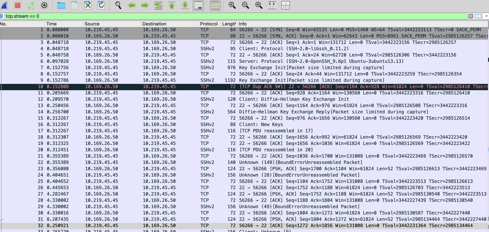
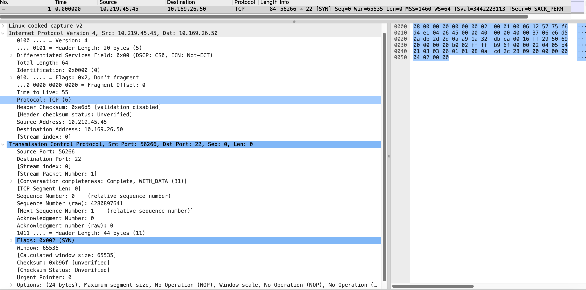
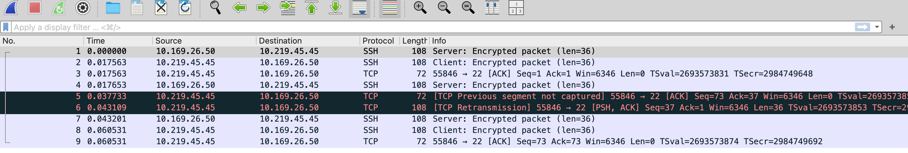
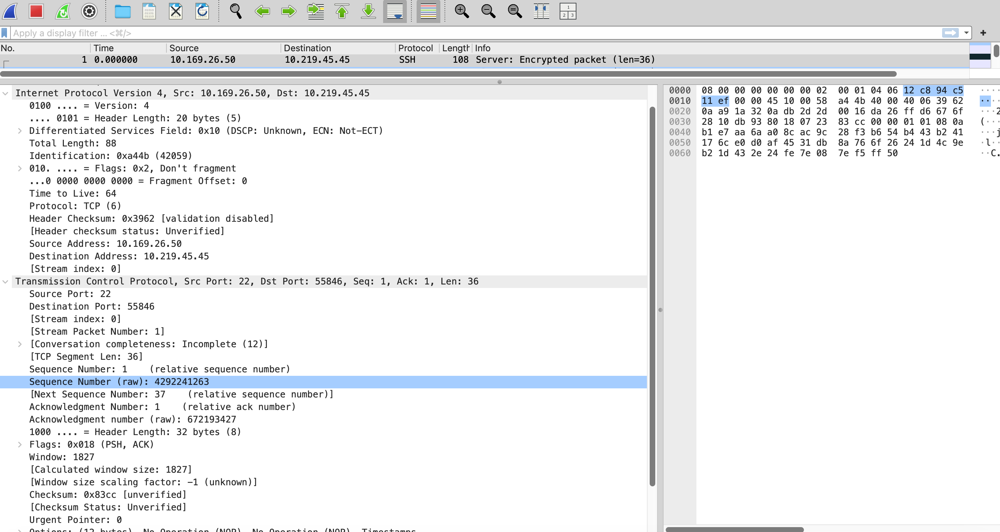
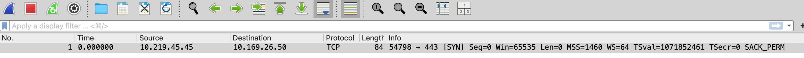
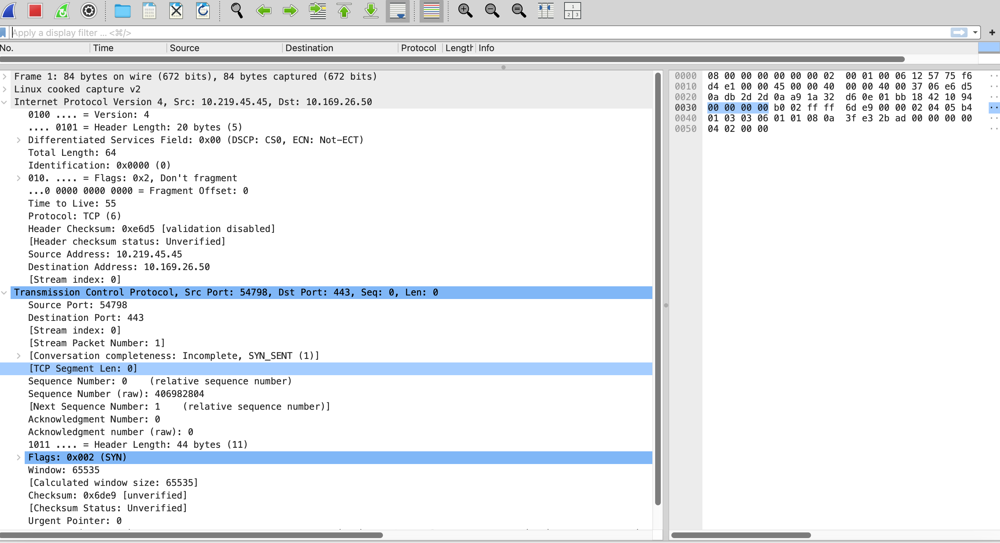

# Packet Analysis Lab — README.md

> SSH brute-force detection & packet analysis lab (with sanitized artifacts).

---

**SSH Brute-force Detection & Packet Analysis** — evidence extraction and analysis of an SSH brute-force against an Ubuntu instance.

---

## Overview
This project demonstrates how to capture, sanitize, and document an SSH brute-force attack. Artifacts include sanitized PCAP captures, per-stream extractions, verbose packet dumps, and Wireshark screenshots.

Primary goals:
- Identify brute-force traffic in a capture.
- Quantify attack traffic (counts, rate).
- Extract the stream containing the successful login.
- Provide clear, publishable evidence for reporting.

---

## Lab / Environment
- Attacker: Kali Linux (local or AWS)
- Target: AWS EC2 Ubuntu server (SSH enabled)
- Tools: `tcpdump`, `tshark` (Wireshark CLI), `hydra` (attacker), `ssh`, `journalctl` / `/var/log/auth.log`
- Repo layout:
  ```
  pcaps/
    stream_398_sanitized.pcap
    accepted_login_frames_44-52_sanitized.pcap
    nmap_syn_one_fixed_sanitized.pcap
    ssh_one_sanitized.pcap
    (optional) baseline_sanitized.pcap
  screenshots/
    stream_398_sanitized_filter.png
    stream_398_sanitized_packet.png
    accepted_login_frames_44-52_sanitized_filter.png
    accepted_login_frames_44-52_sanitized_packet.png
    nmap_syn_one_fixed_sanitized_filter.png
    nmap_syn_one_fixed_sanitized_packet.png
    ssh_one_sanitized_filter.png
    ssh_one_sanitized_packet.png
  dumps/
    stream_398_verbose_sanitized.txt
    accepted_login_frames_44-52_sanitized.txt
  README.md
  analysis.md
  LICENSE
  .gitignore
  ```

---

## Key Artifacts (sanitized)
- `pcaps/stream_398_sanitized.pcap` — extracted TCP stream for the successful login (headers only, anonymized).
- `pcaps/accepted_login_frames_44-52_sanitized.pcap` — minimal excerpt around the accepted login.
- `pcaps/nmap_syn_one_fixed_sanitized.pcap` — SYN scan traffic sample.
- `pcaps/ssh_one_sanitized.pcap` — small SSH session example.
- `dumps/stream_398_verbose_sanitized.txt` — verbose dump of stream 398.
- `dumps/accepted_login_frames_44-52_sanitized.txt` — verbose dump of accepted-login frames.

> **Security Note:** All pcaps have been sanitized to remove payloads, anonymize IPs (mapped to `10.0.0.x`), and replace MAC addresses. Credentials and sensitive information have been redacted.

---

## Commands Used (for raw analysis)
These were the original commands used before sanitization. Replace filenames with the sanitized equivalents for reproducibility.

```bash
# total SSH-related packets
tshark -r brute_force.pcap -Y 'tcp.port==22' | wc -l

# extract stream 398
tshark -r brute_force.pcap -Y "tcp.stream==398" -w stream_398.pcap

# extract frames 44–52 from stream
tshark -r stream_398.pcap -Y 'frame.number >= 44 && frame.number <= 52' \
  -w accepted_login_frames_44-52.pcap

# verbose dumps (later sanitized)
tshark -r stream_398.pcap -V | tee stream_398_verbose.txt
tshark -r accepted_login_frames_44-52.pcap -V | tee accepted_login_frames_44-52.txt
```

---

## Findings / Metrics (from raw analysis)
- SSH packet count: **16,572**
- Capture duration (SSH packets): **~469 seconds**
- Packets/sec: **~35.35**
- SYN-only attempts to port 22: **418**
- Distinct sessions: **~838**
- Top source IPs (before anonymization): attacker vs. local host roughly split 50/50.
- Hydra recorded one valid credential (redacted in public repo).
- Logs showed one successful login event aligned with **stream 398**.

---

## Evidence & Screenshots
Each sanitized artifact is paired with screenshots:

- **Stream 398**
  - 
  - 

- **Accepted login frames 44–52**
  - 
  - 

- **Nmap SYN scan**
  - 
  - 

- **SSH session example**
  - 
  - 

---

### MITRE ATT&CK Techniques Observed
- T1110 – Brute Force (SSH password guessing)
- T1046 – Network Service Scanning (TCP port probes)
- T1021 – Remote Services (SSH)
- T1078 – Valid Accounts (successful credential use)
- T1573 – Encrypted Channel (SSH encrypted tunnel)

---

## Recommendations / Mitigations
- Disable SSH password authentication (`PasswordAuthentication no`).
- Disable root login (`PermitRootLogin no`).
- Use fail2ban or similar to block brute-force attempts.
- Require strong, unique credentials or enforce MFA.
- Restrict SSH exposure (security groups, VPN, bastion host).

---

## Notes
- Published pcaps are sanitized; raw captures are archived privately.
- Timestamps are preserved but anonymized captures may alter flow slightly.
- This project is for authorized lab testing only.

---

## Author
Wade Liffick — `wliffick`  


---

## License
MIT — feel free to reuse for personal labs and reporting.

